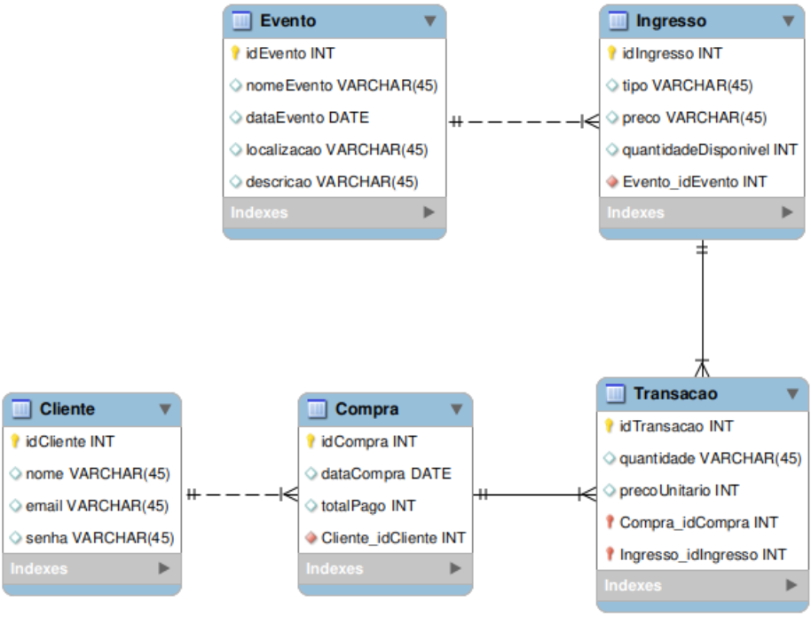

# 🚀 Interface Web Simples com Flask

Este projeto foi elaborado na disciplina de Banco de Dados com o objetivo de demonstrar aos alunos como realizar a conexão com um banco de dados MySQL e utilizar a linguagem SQL para interagir com ele. A aplicação web é desenvolvida com Flask, possui um formulário para cadastrar ingressos, e a interface é estilizada com Bootstrap.

---

## 🛠️ Tecnologias Utilizadas

- 🐍 **Flask:** Framework web em Python.
- 🌐 **HTML:** Utilizado para criar o formulário de cadastro.
- 🎨 **Bootstrap:** Para estilizar rapidamente e obter uma interface amigável.
- 🗃️ **MySQL Connector:** Para conectar ao banco de dados MySQL.

---

## 📂 Estrutura do Projeto

```
banco-de-dados-exemplo/
├── .venv/
├── templates/
├── venv/
├── app.py
├── modelagem.png
└── readme.md
```

---

## 🚀 Requisitos de Instalação

Antes de executar o projeto, instale as seguintes bibliotecas utilizando o `pip`:

```bash
pip install flask mysql-connector-python
```

### 🗃️ Banco de Dados

Para que o código funcione corretamente, é necessário implementar um banco de dados seguindo a modelagem mostrada na figura abaixo:



Certifique-se de que o banco esteja configurado e acessível pela aplicação.

---

## 💡 Como Executar

Após instalar as dependências e configurar o banco de dados, basta rodar o arquivo principal:

```bash
python app.py
```

A aplicação estará disponível em `http://127.0.0.1:5000/`.

---